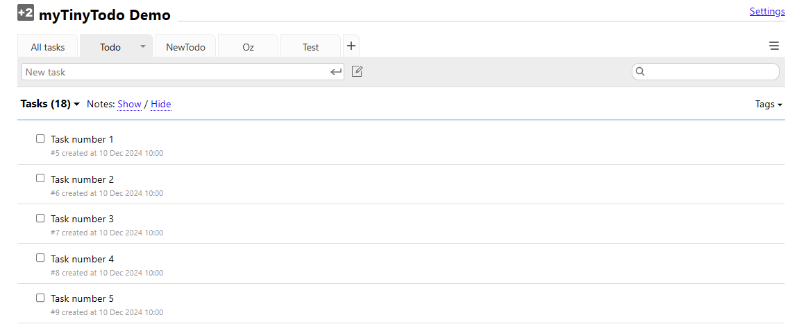

# MyTinyTodo Test Report

This repository contains a test report for the open-source application **MyTinyTodo**, which is a simple tool for creating and managing todo lists. Below is a summary of the application and the tests performed.

## About MyTinyTodo

**MyTinyTodo** is an open-source and free application for managing todo lists with tasks and priorities.

### Key Features:
- Multiple todo lists.
- Task notes and tags.
- Priority levels (-1, 0, +1, +2).
- Due dates.
- Drag-and-drop sorting.
- Search functionality.
- Password protection.
- Smart syntax for creating tasks (e.g., `±priority Task #Tag1 #Tag2 @duedate`).
- Print-friendly CSS and dark mode.
- Mobile device support.

### Technical Details:
- **Backend**: Written in PHP.
- **Frontend**: Uses jQuery.
- **Database Support**: PostgreSQL, MySQL, or SQLite.
- **License**: GNU GPL.

### Latest Updates:
- **v1.8.1** (2024-01-28): Latest stable version.
- **v1.7.6** (2023-09-14).
- **v1.6.10** (2022-05-03).

### [Demo Available Here](https://www.mytinytodo.net/demo)

## Purpose of This Repository
This repository documents the tests I conducted on the MyTinyTodo application, focusing on its functionality and features.

## Tests Conducted

### Environment:
- **Browser**: Chrome 131.0.6778.109.
- **Server**: Localhost.
- **Database**: MySQL.

### Test Scenarios:

#### 1. Adding Todo Lists:
- Verified the ability to create new todo lists.
- Tested naming lists with various lengths and special characters.

#### 2. Adding Tasks:
- Successfully added tasks with the following attributes:
  - Task name.
  - Tags (e.g., `#urgent`, `#personal`).
  - Priority levels (-1 to +2).
  - Due dates (e.g., `@2024-12-10`).
- Used the smart syntax to simplify task creation.

#### 3. Editing Tasks:
- Tested the ability to edit task names, priorities, due dates, and tags.

#### 4. Deleting Tasks:
- Verified the ability to delete tasks from a list.
- Confirmed tasks are removed from the database.

#### 5. Deleting Todo Lists:
- Successfully deleted entire todo lists.
- Confirmed associated tasks were also removed.

#### 6. Search Functionality:
- Tested searching for tasks using keywords and tags.
- Confirmed results were accurate.

#### 7. Drag-and-Drop Sorting:
- Verified that tasks could be reordered via drag-and-drop.

#### 8. Dark Mode:
- Tested dark mode on desktop and mobile browsers.

## Observations
- The application performed well overall.
- **Strengths:**
  - Easy to use with intuitive UI.
  - Smart syntax simplifies task creation.
  - Lightweight and fast.
- **Areas for Improvement:**
  - Better error handling for invalid inputs.
  - Enhanced mobile responsiveness for certain features.

## How to Install MyTinyTodo
1. Download the latest version from the [official website](#).
2. Set up a web server (e.g., Apache or NGINX).
3. Configure the database connection (PostgreSQL, MySQL, or SQLite).
4. Deploy the application files to the server.
5. Access the application in your browser.

## Conclusion
MyTinyTodo is a robust application for managing todo lists. My tests confirm that it delivers on its promises for simplicity and functionality. Further improvements could make it even better for end users.

Feel free to fork this repository and contribute! If you encounter issues, please open an issue or pull request.
